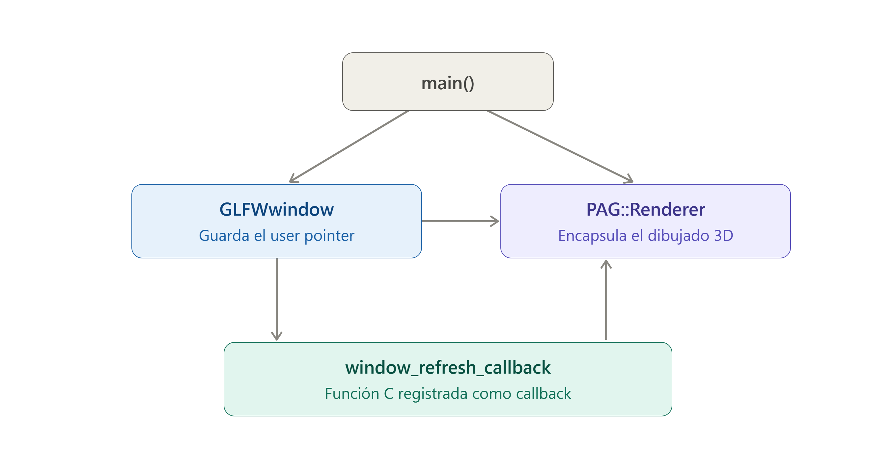


# Práctica 1 - Lucía Cano Cubillo

## Ejercicio de reflexión: comunicación entre callbacks en C y `PAG::Renderer`

Para resolver este problema, se aprovecha una funcionalidad que la propia biblioteca GLFW proporciona para este tipo de casos: el **"user pointer"** de la ventana, accesible mediante las funciones `glfwSetWindowUserPointer` y `glfwGetWindowUserPointer`, que permiten asociar un puntero genérico a cada ventana creada.

El objeto de la clase `PAG::Renderer` debe declararse como un **puntero**, ya que es precisamente su dirección de memoria la que se necesita almacenar en la ventana; este objeto debería inicializarse en el módulo principal de la aplicación (`main`), justo después de crear la ventana con `glfwCreateWindow`, vinculando ambos mediante `glfwSetWindowUserPointer`.

De esta forma, cada función callback en C, que sí recibe como parámetro la ventana sobre la que se produjo el evento, puede recuperar el puntero al renderer asociado mediante `glfwGetWindowUserPointer` y limitarse a invocar el método correspondiente (por ejemplo, `refrescarVentana()`), sin necesidad de conocer nada sobre el funcionamiento interno de la clase `PAG::Renderer`, lo que mantiene el acoplamiento entre las funciones callback y la lógica de dibujado en el mínimo posible.
 

## Diagrama UML

