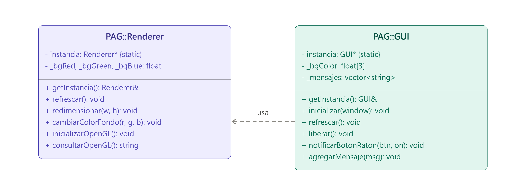


# Práctica 2 - Lucía Cano Cubillo

## Explicación de los cambios realizados

### PAG::Renderer (patrón Singleton)

Toda la lógica que antes llamaba directamente a funciones de OpenGL desde
`main.cpp` (`glClear`, `glClearColor`, `glViewport`, `glEnable`,
`glGetString`) se ha movido a una clase `PAG::Renderer`, implementada
como Singleton (atributo estático privado, constructor privado, acceso
único mediante `getInstancia()` con inicialización perezosa).

Como resultado, `main.cpp` ya no contiene ninguna llamada directa a
funciones de OpenGL: solo llama a GLFW, GLAD, y a los métodos públicos de
`PAG::Renderer` y `PAG::GUI`.

### PAG::GUI (patrón Singleton)

Siguiendo la Figura 4 del guion, se ha creado una segunda clase
Singleton, `PAG::GUI`, que encapsula toda la comunicación con Dear ImGui.
Ni `main.cpp` ni `PAG::Renderer` incluyen ninguna cabecera de ImGui.
Cuando el usuario cambia el color en el selector, `GUI` delega en
`Renderer::cambiarColorFondo(...)` en vez de tocar OpenGL directamente.

### Controles de Dear ImGui

- **Ventana "Fondo"**: un `ColorPicker3` con rueda de tono para cambiar
  el color de fondo de la escena de forma interactiva.
- **Ventana "Mensajes"**: sustituye la consola como salida de mensajes
  de la aplicación (arranque, info de OpenGL, teclas, botones del ratón,
  scroll, errores de GLFW).

### Reenvío de eventos de ratón a Dear ImGui

Como GLFW solo permite un callback por tipo de evento y ventana, al
registrar `mouse_button_callback` propio se sobrescribía el callback que
Dear ImGui instala automáticamente. Se soluciona notificando el evento
manualmente a `PAG::GUI`, que reenvía el evento a Dear ImGui.

## Diagrama de clases

`main.cpp` inicializa y usa tanto `PAG::Renderer` como `PAG::GUI` (ambos
Singleton). `PAG::GUI` depende de `PAG::Renderer` únicamente para
comunicarle el nuevo color de fondo; ninguna de las dos clases conoce la
biblioteca de la otra por dentro.

## Nota sobre dependencias

Dear ImGui no se incluye en el repositorio (ver `.gitignore`); es
necesario descargarlo desde https://github.com/ocornut/imgui.

# Práctica 3 - Lucía Cano Cubillo

## Explicación de los cambios

Partiendo de la práctica 2, en esta sesión se ha añadido el renderizado de un triángulo:

- **Geometría y shaders en `PAG::Renderer`**: se han añadido los atributos para los identificadores de VAO, VBO, IBO y shaders, junto con los métodos `creaShaderProgram()` y `creaModelo()` para crearlos.

- **Comprobación de errores con excepciones**: tanto la compilación de cada shader (`compilarShader`) como el enlazado del shader program (`enlazarPrograma`) comprueban su resultado y, si falla, lanzan una `std::runtime_error` con el log que devuelve OpenGL. Estas excepciones se capturan en `main.cpp` y el mensaje de error se muestra en la ventana de Mensajes de la interfaz, en vez de cerrar la aplicación.

- **Shaders en archivos externos**: el código GLSL ya no está embebido como texto en `Renderer.cpp`, sino en los archivos `pag03-vs.glsl` y `pag03-fs.glsl`, que se leen con el método `leeArchivo()`. El CMakeLists.txt copia estos archivos al directorio de ejecución.

- **Color por vértice**: se ha añadido un segundo atributo (color) a la geometría, interpolado entre los tres vértices del triángulo (rojo, verde y azul). Se ha implementado con un único VBO entrelazado (posición y color en el mismo array); la versión alternativa con dos VBOs separados se ha dejado comentada en el código, en `creaModelo()`.

- **Limpieza de `main.cpp`**: los callbacks de refresco y redimensionado ya no escriben en consola, sino que envían sus mensajes a la ventana de Mensajes de la GUI, y se ha corregido el nombre del parámetro `errno` del callback de errores por conflicto con la macro del mismo nombre.

## ¿Por qué se deforma el triángulo al redimensionar la ventana?

El triángulo lo dibujamos con unas coordenadas fijas, entre -1 y 1, y el shader no hace nada más que colocarlas tal cual están, sin ningún cálculo extra.

El problema es que, para pintar esas coordenadas en la ventana, OpenGL las estira hasta ocupar todo el área de dibujo, es decir, todo el ancho y todo el alto que tenga la ventana en ese momento (esto lo hacemos con `glViewport`, que llamamos cada vez que la ventana cambia de tamaño).

Si la ventana no es cuadrada, esa transformación escala el eje X y el eje Y en proporciones distintas, así que el triángulo se ensancha o se estrecha según la relación de aspecto de la ventana en cada momento. Por eso el triángulo se ve estirado o aplastado según la forma que tenga la ventana en cada momento.

